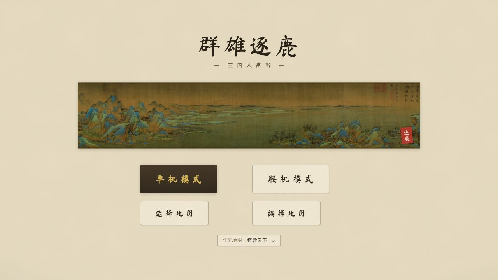
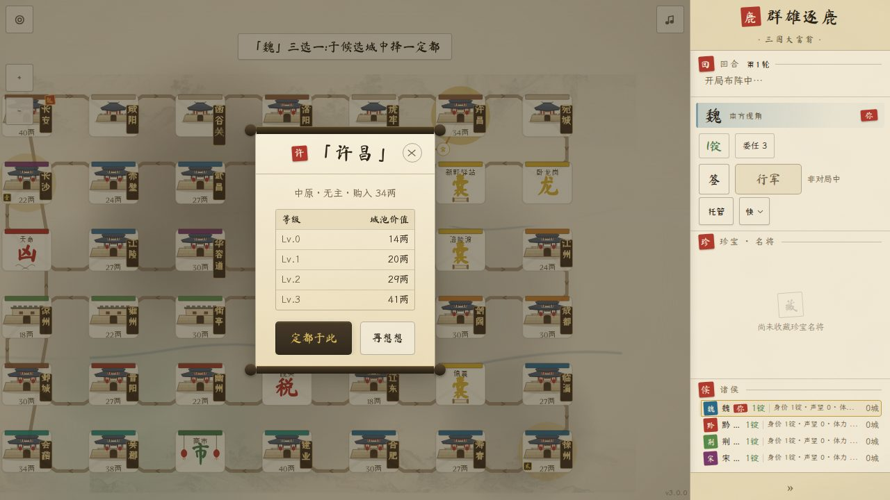
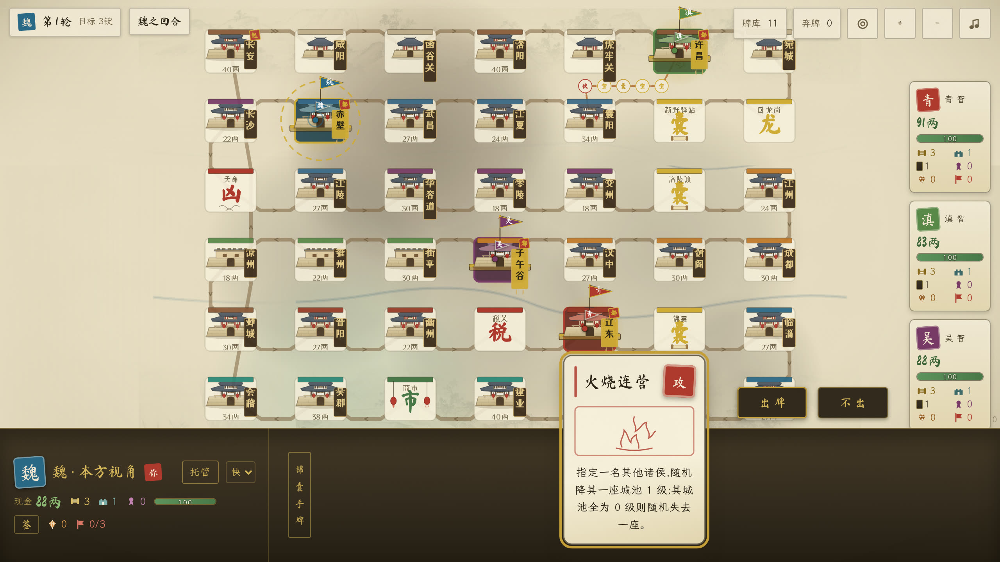

# 新手第一局:从起兵到称帝

> 本文带你走完第一局**单机对局**:你执一国,对手是电脑。每一步只说两件事——**你会看到什么、你该点什么**;规则原理不展开,想深究就顺着「详见」跳转。跟着点,一局大约二十分钟。

## 开一局单机

打开 **`https://dafung.openaddr.cn`**,首页四个入口里点 **「单机模式」**。

## 起兵:立国号、定诸侯

配置页是一张卡片,从上到下:

- **诸侯数**:默认 4——第 1 行是你,其余全是电脑。首局想快可减到 2。
- **目标身价**:速战(1锭50两)/ 标准(3锭)/ 鏖战(6锭),攒够这个数就赢。首局选「速战」。
- **AI 难度**:「智将(EV)」会算账,「庸才(随机)」碰运气。首局建议「庸才(随机)」。
- **机遇(落格触发事件)**:一个折叠区,保持默认即可,不用展开。
- **国号**:填一个汉字,或在「字盘快选国号」点选一个;起兵后会记住,下次自动带入。
- 其余座位不用管,电脑的国号开局时自动分配。

点 **「起兵」**,按钮短暂变成「调兵遣将中…」,随后进入棋盘。

## 国号与点将:你不用动手的两步

进入棋盘后不用动手:系统自动完成登记国号、全员掷骰排定**选都顺序**(这一步叫**点将**),随后按名次轮流选都。开局流程全貌详见 [02-开局](../reference/rules/02-开局.md)。

## 三选一选都

轮到你时:

- **你会看到**:地图上三座候选城亮起金圈,顶部横幅提示「魏」三选一:于候选城中择一定都」。
- **你该点什么**:点一座候选城,弹出这座城的详情卷轴,确认就点 **「定都于此」**;想换一座,点 **「再想想」** 回去重挑。

怎么挑?三座候选天生一档便宜、一档中档、一档昂贵,卷轴里的「购入」价可当参考——首局图省事就挑最便宜的:定都实际花的是**建城费**(另一档价,细则见 [02-开局](../reference/rules/02-开局.md)),钱少花一点,现金就多一点。这座城从此是你的**都城**:行军起点,兼钱袋子——每圈路过都有补给进账(见 [04-地产经济](../reference/rules/04-地产经济.md))。选完都,对局正式开始。

## 前三个回合,照着走

### 第 1 回合:掷骰行军,认识落格

- **你会看到**:底部仪表条有你的国号、「你」印、现金大数和委任状等徽章,旁边一枚「签」章驻留掷骰点数;轮到你时,棋盘上先钤一方「签」印起签,随后**自动掷骰**——看一段掷骰动画,棋子自己前进点数那么多格,不用点任何按钮。
- **你该点什么**:什么都不用点,看棋子走。若一进来底部手牌架的牌**金边上浮**(军师窗态:起手发的那张锦囊在问你用不用),首局建议点 **「不出」**,放行后自动开走。

落定之后看落点,最常遇到:

| 落到哪 | 你会看到 | 你该点什么 |
|---|---|---|
| 无主城 | 「购地抉择」卷轴:购入价与逐级价值 | 想买点 **「购地」**(花银两,另耗 1 委任状);不买点 **「不取」** |
| 自己的城 | 「扩军抉择」卷轴 | 点 **「扩军(免费)」** 白赚 1 级,或点「按兵不动」 |
| 锦囊格 | 抽一张锦囊牌 | 不用点;屏幕底部**手牌架**多出一张牌面 |
| 路过自己都城(绕一圈后) | 行军半路被迫停下,领 +2 委任状,回合就此结束 | 不用点,这是「必停」规矩;详见 [03-回合与行军](../reference/rules/03-回合与行军.md) |

没弹卷轴就是无事发生。另外两点:每次落格都可能先触发「机遇」卷轴(默认四成概率)——读文案、挑一条即可,详见 [07-声望与机遇](../reference/rules/07-声望与机遇.md);若弹出「招贤纳士」卷轴(比如路过卧龙岗),点一位名将收下即可,详见 [08-名将与技能](../reference/rules/08-名将与技能.md)。等你走完,电脑接手其余玩家,底部显示「智将运筹中…」。全部落格种类详见 [03-回合与行军](../reference/rules/03-回合与行军.md)。

进了手牌的锦囊随时能查:**点一下手牌架上的牌**(或长按)弹出详情,全文、标签、目标一屏读完,Esc 或点旁边关闭。手牌是暗置的——只有你能看自己的,别人界面上只有一个计数。

### 第 2 回合:用一张锦囊

新回合一开始,手里的锦囊会先「问」你一轮(每回合都问,直到你用掉)——不弹窗,手牌架就地进入**军师窗态**:

- **你会看到**:手牌架上方浮出动作条 **「出牌 / 不出」**;可用的牌**金边上浮**,灰掉的是此刻不能用的(原因印在牌上);若你已招到名将,他的主动技(金底「技」章的令笺)也排在架中。
- **你该点什么**:点牌**选中**——牌会放大给你读全文;再点 **「出牌」** 才真正出牌,要指人的牌接着点**金圈呼吸的目标国号**(席位卡或棋盘上的棋子都行)。点别的牌可换选,右键或长按可取消;键盘党用**数字键**选牌、**Enter** 确认。不急着用,就点 **「不出」** 先留着(牌不消耗)。起手 1 张,落锦囊格等场合还能再进账(手牌无上限)。

八张牌各自干什么,详见 [06-锦囊](../reference/rules/06-锦囊.md)。

### 第 3 回合:落进别人的城,珍宝交涉

落在他人城,且城主手里有珍宝时:

- **你会看到**:「珍宝抉择」卷轴,「魏 落『许昌』。蜀 有 2 件珍宝,正在权衡是否出售…」这样的文案。
- **你该点什么**:基本不用点——**决定权在城主**(此刻是电脑)。他决定卖,你就按价掏钱,不能拒买;现金不够会被先逼着变卖家产抵账(详见 [09-破产清算](../reference/rules/09-破产清算.md))。不想干等,点右上 × 收起卷轴。

反过来,电脑落到**你的**城时,由你开价,三选一:**暂不交易**(无事发生)/ **公道买卖**(按指导价卖给他,钱进你口袋,你的城还 +1 级)/ **坐地起价**(加价卖,城不升级)。交涉细则详见 [05-珍宝](../reference/rules/05-珍宝.md)。

## 怎么赢:把现金攒到目标身价

- **身价只数现金**:城池、珍宝都不算数。右缘席位卡上每个对手的现金随时可查,自己的在底部仪表条——它就是身价。
- 进账靠两手:**都城补给**(经过或落到自己都城都有,城等级越高越多)和**卖珍宝**(去宝物城拼点探宝,详见 [05-珍宝](../reference/rules/05-珍宝.md))。本作**没有过路费**——占城多不等于赚得多,现金为王。
- 有人身价达到起兵时定的目标,即刻称帝终局:全屏庆功,点 **「再战一局」** 再来一把,或点 **「导出日志」** 存一份对局档案。

两种胜利方式与身价原理详见 [01-总览与胜利](../reference/rules/01-总览与胜利.md)。

## 卡住了怎么办

- **掷骰还没发生**:轮到你时先等「起签」一拍(约两秒内自动开走);若迟迟不动,多半是还有决策等你处理(购地/机遇等卷轴,或手牌架的军师窗态),作答即继续。
- **选错了**:别慌,几乎没有一步选错就万劫不复的决策;真欠了债也有变卖自救的流程(见 [09-破产清算](../reference/rules/09-破产清算.md))。
- **要暂离**:底部仪表条点 **「托管」** 让电脑代打(快/慢两档),回来再点 **「收回」**。
- 下一步想和朋友各带一台设备对战:见[联机对战](../how-to/联机对战.md)。

## 想深入了解(可选)

- 规则手册全十页:[docs/reference/rules/](../reference/rules/README.md)
- 玩家用词与内部术语的对照表:[CONTEXT.md](../../CONTEXT.md)
